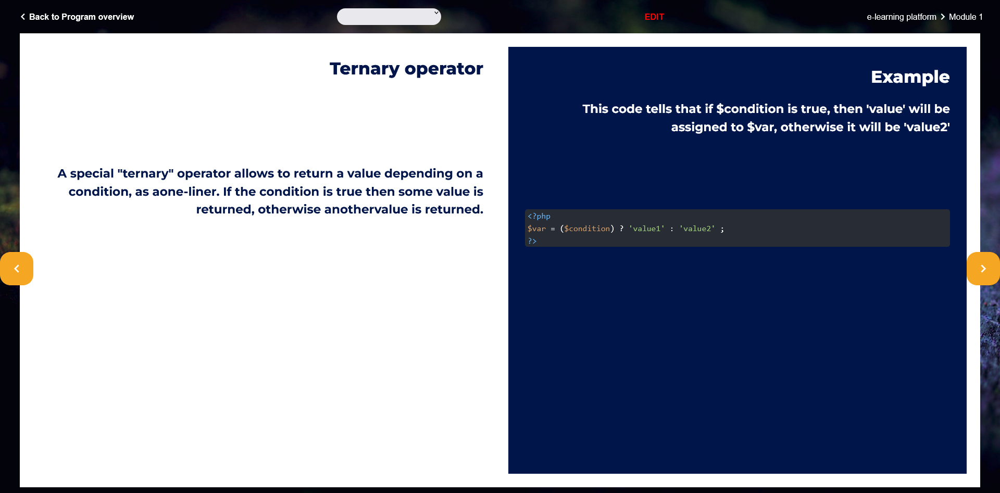
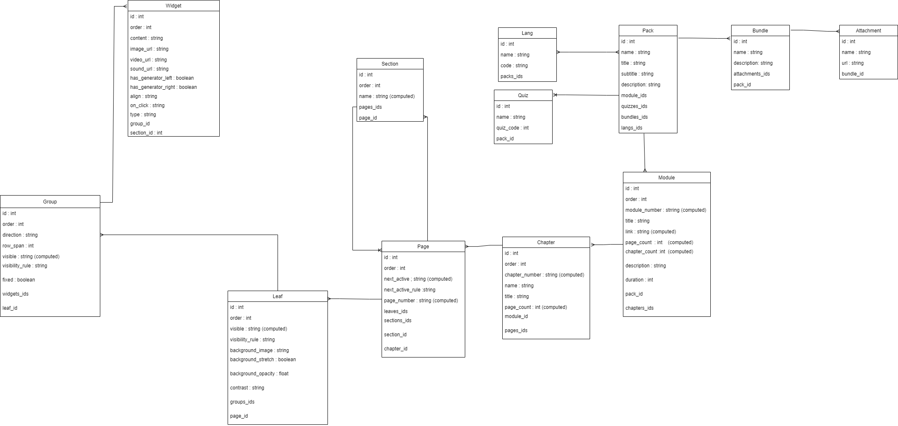
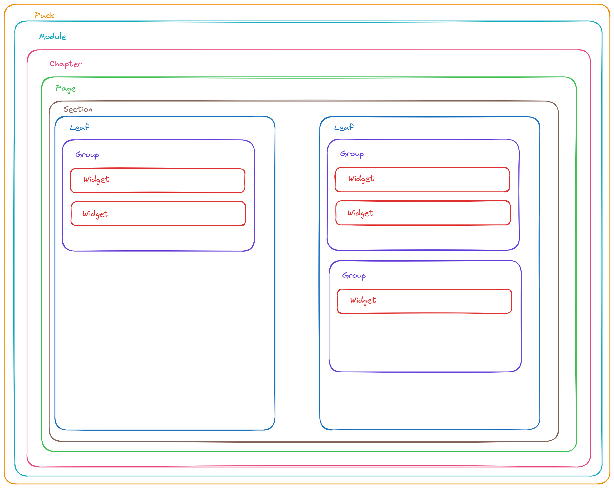
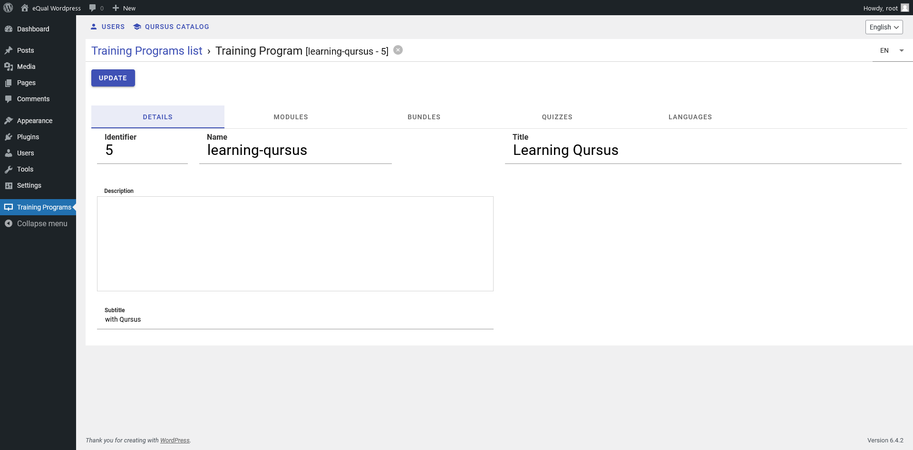
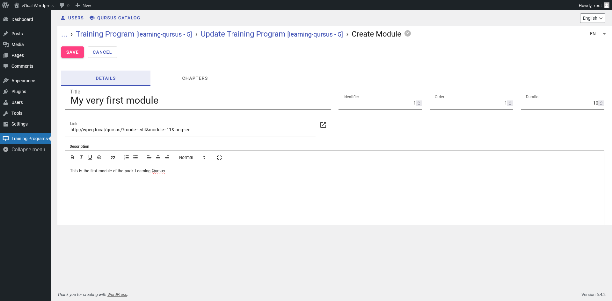
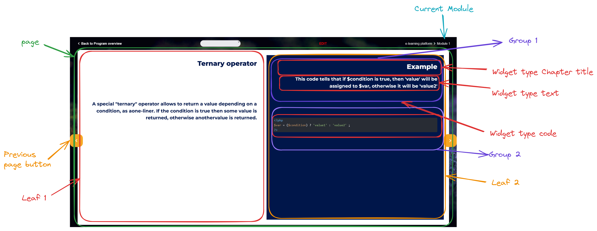

# Qursus
[](https://www.gnu.org/licenses/lgpl-3.0)
[](https://github.com/yesbabylon)
[](https://github.com/cedricfrancoys/equal/pulls)
<!--  -->

<a href="https://github.com/equalframework/" style="font-size:2rem;display:flex; align-items:center; wrap; flex-wrap: wrap; flex-shrink:0; text-decoration:none; color:inherit">Made with eQual framework 
</a>



## Why Qursus :

We needed a way to present people about how to use eQual so we created this app. Ultimately, you will be able to learn how to use Qursus, how to use eQual framework by following our module Qursus.

## How do we propose to solve the problem by using Qursus

Qursus uses eQual framework in back-end to connect to modules of lessons. There are two views. A user can view a lesson or if the person has the rights there is an edition mode. Every module can be created and edited in the browser, in command lines or through the api, by a user with the correct credentials.

## How does Qursus work ?

Qursus works with eQual on the back-end. The eQqual serves the data, auth and controls the views. The Packs, Users and different modules and it chapters can be created in Wordpress by using the Qursus Plugin. The student can follow the lesson using the web app that is deployed in /public when the package qursus is initiated.

**UML Diagram of the application**



**Schema of the application**

A Qursus application contains one or several packs which can contain one or several modules which are themselves divided into chapters and pages. Each page has sections and "leaves". Leaves are divided into groups of 8 spaces per leaf. Those spaces can contain widgets. A widget can be a picture, a text, a title, some code excerpt... A pack can also have a bundle which is basically a zipped piece of attachments (video, pictures, pdf files) the student can download to follow the course.




## Install Qursus

Prerequisite : To install Qursus, eQual should be installed. Go to the [eQual documentation](https://doc.equal.run/getting-started/installation/) installation page.

Then navigate to your eQual in your docker or server instance. Then you need to add qursus to the packages. It is currently located in the [symbiose repository on github](https://github.com/yesbabylon/symbiose) under the branch dev-2.0. Fetch the repo in /packages then init the package qursus.

```bash
cd /var/www/html/
git clone https://github.com/yesbabylon/symbiose.git packages
cd /var/www/html/packages
git checkout dev-2.0
git pull
cd /var/www/html/
./equal.run --do=init_package --package=qursus
```

Now in your qursus package you should see :

```
/packages
    /qursus
        /actions
             import.php --> Create Modules, Chapters, Leaves, Pages, Groups and Widgets based on ATModule.json file.
             next.php --> Handle action from user when performing a click to see next page of a given module.
             survey.php --> Send an invite to satisfaction survey.
        /apps
            /qursus --> front-end in TypeScript and jQuery web.app that will be unpacked in /public/qursus on init
                export.sh -->
                web.app --> zip of the front-end build
                manifest.json
        /classes
            Bundle.class.php
            BundleAttachment.class.php
            Chapter.class.php
            Group.class.php
            Lang.class.php
            Leaf.class.php
            Module.class.php
            Pack.class.php
            Page.class.php
            Quiz.class.php
            Section.class.php
            UserAccess.class.php
            UserStatus.class.php
            Widget.class.php
        /data
            /module
                render.php  --> Returns a fully loaded JSON formatted single module
            /pack
                access.php --> Checks if current user has a license for a given program.
                certificate.php --> Returns a html page or a signed pdf certificate.
                complete.php --> Checks if a pack has been fully completed by current user.
                grant.php --> Checks if current user has a license for a given program.
            bundle.php   --> Sends either a single attachment or a zip archive containing all attachments.
            module.php  --> Returns a fully loaded JSON formatted single module.
            modules.php  --> "Returns a list of all modules for a given pack, enriched with current user status.
        /init
            /data
        /views
            Bundle.list.default.json
            Bundle.form.default.json
            ...
            Widget.form.create.default.json
            Widget.form.default.json
            Widget.list.default.json
        config.inc.php --> specify the DEFAULT_PACKAGE constant used for routing
        manifest.json --> usual eQual package manifest
```


## Configuration :

In the context of using equal with Wordpress we need to configure the environnement file and the `.htacces` file.

The configuration file will indicate what is the back-end api and what is the front-end api.
**/public/assets/env/config.json**
```json
{
    "production": true,
    "parent_domain": "equal.local",
    "backend_url": "http://wpeq.local/equal.php",
    "rest_api_url": "http://wpeq.local/",
    "lang": "en",
    "locale": "en",
    "company_name": "eQual Framework",
    "company_url": "https://yesbabylon.com",
    "app_name": "eQual.run",
    "app_logo_url": "/assets/img/logo.svg",
    "app_settings_root_package": "core",
    "version": "1.0",
    "license": "AGPL",
    "license_url": "https://www.gnu.org/licenses/agpl-3.0.en.html"
}
```

**/public/.htacces**
```ruby
Options -Indexes
DirectoryIndex index.php equal.php index.html

# BEGIN WordPress
# The directives (lines) between "BEGIN WordPress" and "END WordPress" are
# dynamically generated, and should only be modified via WordPress filters.
# Any changes to the directives between these markers will be overwritten.
<IfModule mod_rewrite.c>
RewriteEngine On
RewriteRule .* - [E=HTTP_AUTHORIZATION:%{HTTP:Authorization}]
RewriteBase /
RewriteRule ^index\.php$ - [L]
RewriteRule ^userinfo$ equal.php [L,QSA]
RewriteRule ^appinfo$ equal.php [L,QSA]
RewriteRule ^envinfo$ equal.php [L,QSA]
RewriteRule ^workbench$ equal.php [L,QSA]
RewriteCond %{REQUEST_FILENAME} !-f
RewriteCond %{REQUEST_FILENAME} !-d
RewriteRule . /index.php [L]
</IfModule>

# END WordPress
```

**/packages/qursus/config.inc.php**
```php
<?
namespace config;
define('WEBSITE_URL', 'http://wpeq.local');
define('WEBSITE_TITLE', 'Learning with Qursus');
```

## Tips and help

Use --announce to get information about the controller. Since eQual controllers are self documented, you will know how it works.
```bash
./equal.run --get=model_collect --announce
./equal.run --do=model_update --announce

```

## Pack

A pack is at the basis of a qursus. It has a title, a subtitle and languages it is available into. Some (learning) modules will be attached to the pack. For example, the package **Learn eQual** could have modules called **back-end , front-end, low-code**.

To create a pack. You can go to the Wordpress part of your site http://wpeq.local/wp-admin/index.php and create the Pack with the **YB LMS** plugin installed and activated. Or if you don't have Wordpress, go to the In the dashboard menu, select Pack and click on the button create. You should get a form and enter the title, the slug of the package which should be unique. You can add a subtitle if you wish. Don't forget to click on the save button.

A pack is defined by :
 - name a unique slug for the pack : *example : slug-of-qursus-first-pack*
 - title : string: *example : Learning Qursus*, The title is `multilang` so you can set a different one according to the language the pack is available in.
 - subtitle : string: *example : by using Qursus*, This field is `multilang` so you can set a different one according to the language.
 - description : text 'Description of the content of the pack, modules, chapters, etc.'*example : This is a basic description of what is taught in this pack. I can write the numbers and names of the modules, etc.*
 - modules : alias of modules_ids, the relationship between modules and the pack.
 - modules_ids : a relation one2many, a pack can have many modules.
 - quizzes_ids : a relation one2many, a pack can have many quizzes.
 - bundles_ids : a relation one2many, a pack can have many bundles.
 - langs_ids : a relation many2many, a pack can have many languages and a language can be available in many packs.




If the pack is deleted, its associated modules are deleted too.

To create a pack you can also use the usual eQual controllers :
http://wpeq.local/equal.php/?do=model_create&entity=qursus\Pack&fields[state]=draft&lang=en

```bash
./equal.run --do=model_create --entity=qursus\Pack --fields[state]=draft --lang=en
```

You can the update this model.


The response should be:
```json
{
    "entity": "qursus\\Pack",
    "id": 6
}
```

You can update the Pack entries:
```bash
./equal.run --do=model_update --entity='qursus\Pack' --ids=6 --fields='{name:"slug-of-the-pack", title:"Title of the Pack", subtitle : "Subtitle of the Pack", description: "This is a basic description of what is taught in this pack. I can write the numbers and names of the modules and chapters etc." }'
```
Response :

```json
[
    {
        "id": 6,
        "name": "slug-of-the-pack",
        "title": "Title of the Pack",
        "subtitle": " Subtitle of the Pack",
        "description": " This is a basic description of what is taught in this pack. I can write the numbers and names of the modules and chapters etc.",
        "langs_ids": " ",
        "modifier": 1,
        "state": "instance",
        "modified": "2023-12-19T10:25:58+00:00"
    }
]
```

Now you can check your newly updated pack by using eQual model_collect.

```bash
./equal.run --get=model_collect --entity='qursus\Pack' --domain=['id','=',6]

```
Response
```json
[
    {
        "id": 6,
        "name": "slug-of-the-pack",
        "state": "instance",
        "modified": "2023-12-19T10:28:02+00:00"
    }
]

```

### Languages

You can have a pack so a course available in one or several languages. They are defined by the Lang.class.php. A language has a
 - name : in english *example : french*
 - code : an ISO 639-1 language code by *example : fr*
 - packs_ids : a relation many2one to the packs the language is used in : *example : [1 , 2, 3]*


### Quiz

You can create one or many quizzes for a pack. When the pack is deleted so are its quizzes.
They are defined by the Quiz.class.php. A quiz has a
 - identifier : integer, the unique id of the quiz in the pack *example : 1*
 - name : in english *example : Testing php fundamentals*
 - quiz-code : an integer which is multilang language code by *example : 1 for english, 2 for french, 3 for dutch*
 - packs_ids : a relation many2one to the packs the language is used in : *example : [1 , 2, 3]*

### Bundle and Bundle attachments

You can create one or many Bundles for a pack. When the pack is deleted so are its Bundles. Basically a Bundle is a zip folder the student can download. It contains attachments files that are used to follow the course.
They are defined by the Bundle.class.php and BundleAttachment.class.php. A Bundle has a
 - name : *example : Bundle Module 1 php fundamentals*
 - description : The content of the bundle described in text: *example : book of php fundamentals, video tutorial installation of php, Pdf file of php cheat-sheet*
 - attachments-ids : a relation many2one between the bundle and its attachments*
 - packs_ids : a relation many2one to the packs the bundle is used in : *example : [1 , 2, 3]*

When a bundle is deleted the attachment is removed to. A bundle attachment is defined by :
 - name : *example : Book of php fundamentals by YesBabylon*
 - url : The destination the file is at: *example : https://wpeq.local/qursus/assets/images/qursus.webp, The url is `multilang` so you can set a different one according to the language the pack is available in.
 - bundles_ids : a relation many2one to the bundle the attachment is used in *


## Module

Select the pack you just created, and click on update you can add modules to it.



A module is a major part in your course. It will be divided into chapters and pages.


**View of a page components**



Check the typescript syntax (lint):

`yarn run tsc`

Use babel to transpile .ts file into .js :

`npm run build`

Generate an app.bundle.js that can be embedded to any .html file:

`npm run webpack`